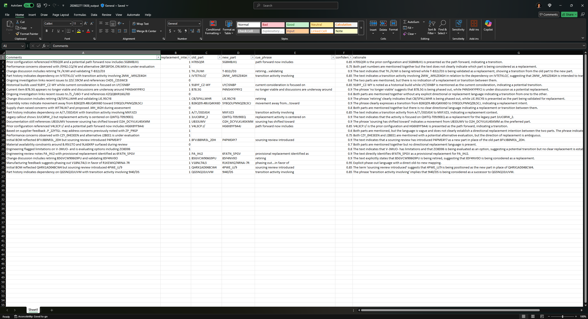

# Part Replacement Extraction Script

**This script is for testing purposes.**

## What this does

Reads an Excel file with a **Comments** column and processes each row through these steps:

1. **Cleans the text** — strips HTML tags, decodes entities, collapses whitespace
2. **Runs the prompt** — sends the cleaned text to Azure OpenAI with instructions to detect part replacement intent
3. **Runs a tool call for JSON output** — the model returns structured JSON via function-calling with `strict: true`, guaranteeing a valid response every time
4. **Flattens the output into Excel** — the JSON fields are written as flat columns in the output spreadsheet

## Setup checklist

### 1. Install Python packages

```
pip install pandas openpyxl openai python-dotenv tqdm
```

### 2. Create your `.env` file

Copy `.env.example` to `.env` and fill in your values:

```
AZURE_OPENAI_ENDPOINT=https://your-resource.openai.azure.com/
AZURE_OPENAI_CHAT_DEPLOYMENT=your-deployment-name
AZURE_OPENAI_API_KEY=your-api-key-here
INPUT_XLSX=your-input-file.xlsx
OUTPUT_XLSX=output.xlsx
TEXT_COLUMN=Comments
```

| Variable | What to put | Required |
|---|---|---|
| `AZURE_OPENAI_ENDPOINT` | Your Azure OpenAI resource endpoint URL | Yes |
| `AZURE_OPENAI_CHAT_DEPLOYMENT` | The model deployment name (e.g. `gpt-4o-mini`) | Yes |
| `AZURE_OPENAI_API_KEY` | Your API key from Azure portal | Yes |
| `INPUT_XLSX` | Path to your input Excel file | Yes |
| `OUTPUT_XLSX` | Base name for the output file | Yes |
| `TEXT_COLUMN` | The column name in your Excel that contains the text | Yes |

**Important:** The `TEXT_COLUMN` value must match your Excel column header exactly (case-sensitive).

### 3. Run

```
python demo.py
```

## Input

An Excel file (`.xlsx`) with at minimum a column named exactly as specified in `TEXT_COLUMN`.
Default expected column name: **Comments**

## Output

A new Excel file with a timestamp prefix, e.g. `20260227113638_output.xlsx`.

The output contains your original data plus these columns appended:

| Column | Description |
|---|---|
| `replacement_intent` | `1` = replacement detected, `0` = no replacement |
| `old_part` | The part being replaced (blank if unclear) |
| `new_part` | The replacement part (blank if unclear) |
| `cue_phrase` | The phrase that signals the replacement |
| `confidence` | Model confidence from 0.0 to 1.0 |
| `rationale` | Short explanation of why the model made its decision |
| `error` | Error message if that row failed (blank if successful) |

### What to expect



- Rows where the model detects replacement intent but can't determine which part is old/new
  will show `replacement_intent=1` with blank `old_part`/`new_part`. Flag these for human review.
- Each run creates a new timestamped file. Previous outputs are not overwritten.
- Processing time depends on row count and API rate limits. The progress bar shows status.
