# Chat-Over-Data Bot — Extron Component Replacements

## What This Is

A conversational bot that lets users ask plain-English questions about
Extron's component replacement data — directly inside **Microsoft Teams**
or a **built-in web UI**.

Ask things like *"How many parts have replacement intent?"* or
*"Show me all rows where confidence is above 0.9"* and get instant,
accurate answers.

**Stack:** Bot Framework SDK (Python) · Microsoft Agent Framework · Azure OpenAI (GPT-5-mini)

## Why It Exists

The data extraction script produces structured replacement
data from hundreds of thousands of free-text comments. This bot makes that
data **queryable by anyone** without writing code or opening a spreadsheet.

## How It Works

A user asks a question. The bot sends it to an LLM (GPT-5 mini), which
decides what data operation to run — count, filter, group, list, etc.
The LLM **never sees raw data**. It calls typed Python functions, reads
their output, and composes a human-readable response.

```
User (Teams or Web UI)
  │  "How many comments have replacement intent?"
  ▼
Bot Framework adapter (aiohttp, port 3978)
  ▼
Microsoft Agent Framework ──► LLM decides which tool to call
  ▼
Data tools (count_rows, query_table, group_by, …)
  ▼
Data layer (Excel or SQL Server)
  ▼
Formatted answer returned to user
  "22 out of 25 comments have replacement_intent = 1."
```

- **Mini model by design** — the bot's job is tool routing, not complex
  reasoning. Mini is cheaper, faster, same accuracy for this workload.
- **Swappable data layer** — switch between Excel and SQL Server with a
  single `.env` change. No code modifications.

---

## Quick Start — Four Checkpoints

Work through these in order. Each checkpoint is a "save point" — don't
move on until the current one works.

### Checkpoint 0: Azure Resources

Before touching the code, make sure you have an Azure OpenAI resource with
a model deployment that supports tool calling. If you already have one from
the data extraction experiment, **reuse it** — same resource group, same
model, same endpoint. No need to provision anything new.

What you need from Azure Portal → your OpenAI resource → Keys and Endpoint:
- Endpoint URL (e.g., `https://your-resource.openai.azure.com/`)
- API key
- Deployment name (e.g.`gpt-5-mini`, etc.)

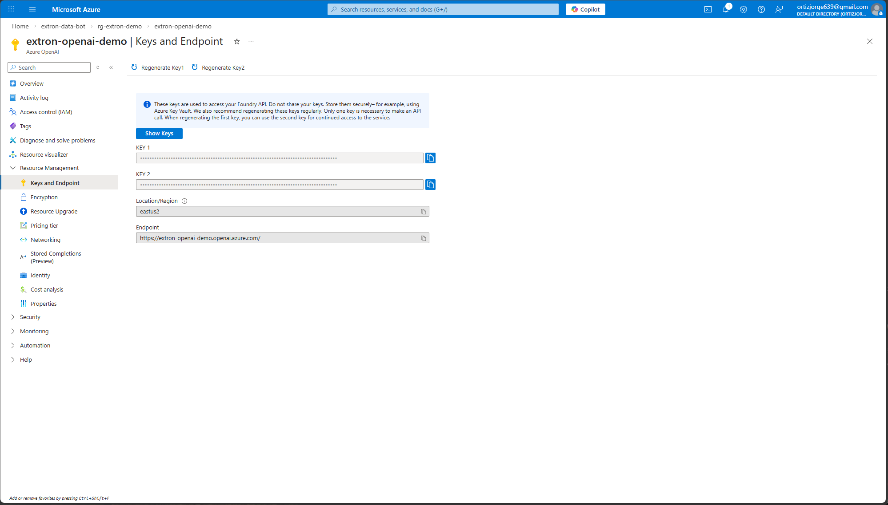

If you need to create a new resource from scratch, see
[Provision Azure OpenAI](#provision-azure-openai) below.

### Checkpoint 1: Local Web UI ✅

Goal: bot answers questions in a browser on your machine.

```bash
cd chat_agent
pip install -r requirements.txt
cp .env.example .env
```

Edit `.env`:
- Paste your Azure OpenAI endpoint, key, and deployment name.
- **Set up your data source.** Start with Excel — it requires no
  infrastructure and lets you verify the bot works end-to-end before
  adding SQL Server.
  - `DATASOURCE` is already set to `excel` by default
  - Drop your `.xlsx` file into the `data/mock/` folder (or point
    `EXCEL_FOLDER_PATH` to another folder)
  - The bot loads every `.xlsx` file in that folder at startup
  - Once everything works, you can switch to SQL Server by setting
    `DATASOURCE=sql` and filling in the `SQL_*` variables
    (see [Environment Variables](#environment-variables))
- Leave the `MICROSOFT_APP_*` fields blank.

```bash
python main.py
```

Open **http://localhost:3978**. Ask: *"How many rows are there?"*
If you get an answer, Checkpoint 1 is done.

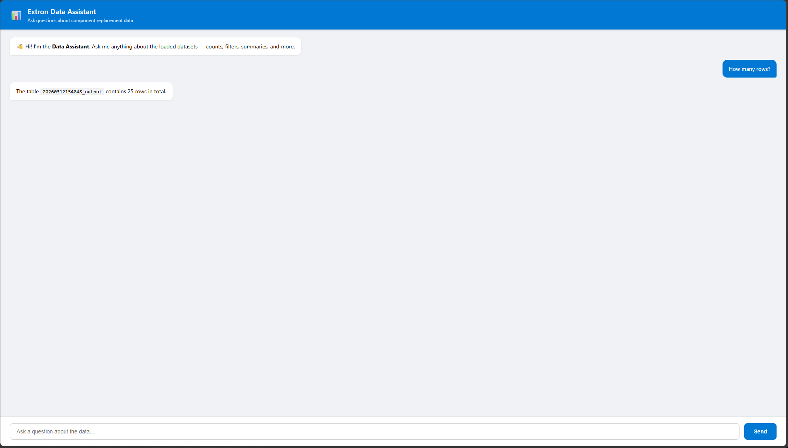

### Checkpoint 2: Deploy to Azure ✅

Goal: bot runs in Azure App Service and responds through Azure Bot Service.

> **Why App Service?** The bot keeps per-conversation sessions in memory
> and runs a persistent web server.

**Step 1 — Register the app in Entra ID**

You need an app registration so Bot Service can authenticate your bot.

1. Azure Portal → **Microsoft Entra ID** → **App registrations** → **New registration**
2. Name: `Extron Data Bot`
3. Supported account types: **Accounts in this organizational directory only** (Single tenant)
4. Redirect URI: leave blank
5. Click **Register**

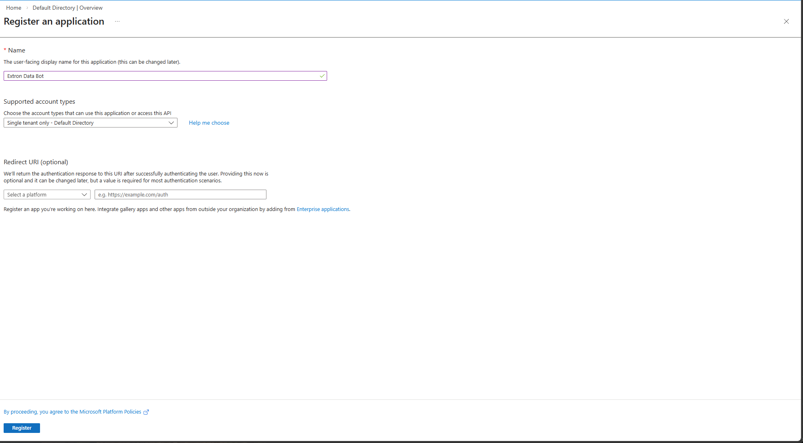

6. On the overview page, copy the **Application (client) ID** and **Directory (tenant) ID** — you'll need both

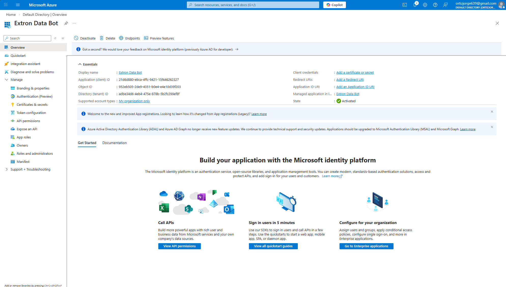

7. Go to **Certificates & secrets** → **New client secret**
   - Description: `bot-secret`
   - Pick an expiry
   - Click **Add** and **copy the secret value immediately** (you can't see it again)

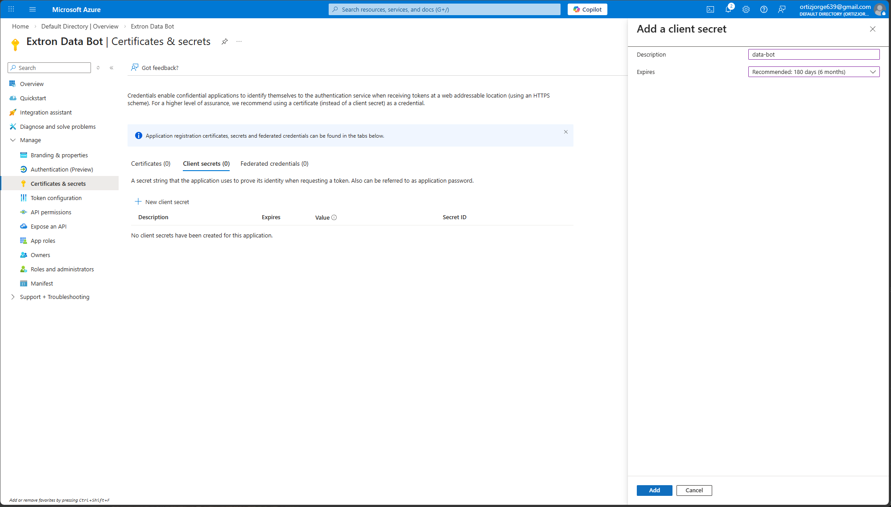

**Step 2 — Create the Azure Bot Service**

1. Azure Portal → **Create a resource** → search **Azure Bot** → **Create**
2. Bot handle: `extron-data-bot`
3. Resource group: use your existing one (e.g. `rg-extron`) or create new
4. Data residency: **Global** (unless your org requires a specific region)
5. Pricing tier: **F0** (free)
5. Type of App: **Single Tenant**
6. Creation type: **Use existing app registration**
7. App ID: paste the **Application (client) ID** from Step 1
8. App tenant ID: paste the **Directory (tenant) ID** from Step 1
9. Click **Review + create** → **Create**

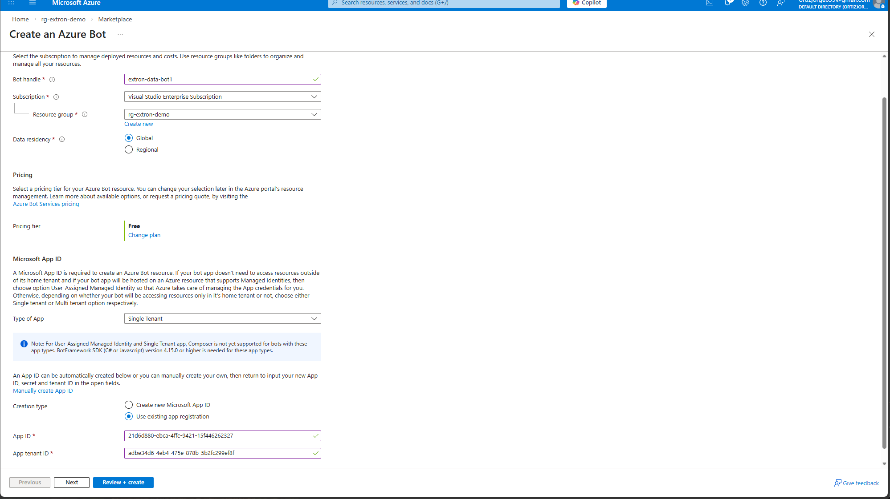

Once created:

10. Go to the Bot Service → **Channels** → **Microsoft Teams** → **Apply**
    (this enables the Teams channel — you'll use it in Checkpoint 3)

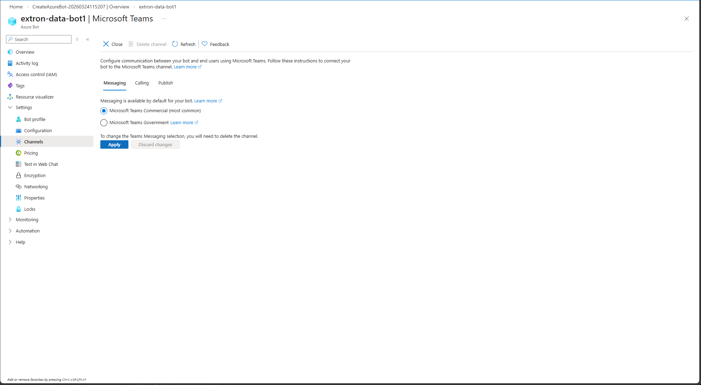

**Step 3 — Create the App Service**

1. Azure Portal → **Create a resource** → search **Web App** → **Create**
2. Resource group: same as your Bot Service
3. Name: pick a name (e.g. `extron-data-bot-app`)
4. Secure unique default hostname: **On** (this adds a random string to
   your URL to prevent name conflicts — leave it on)
5. Publish: **Code**
6. Runtime stack: **Python 3.11**
7. Operating System: **Linux**
8. Region: same region as your Azure OpenAI resource
9. Pricing plan: **B1** (Basic) — a Linux App Service Plan is created automatically
10. Zone redundancy: **Disabled** (not needed for a POC)
11. Click **Review + create** → **Create**

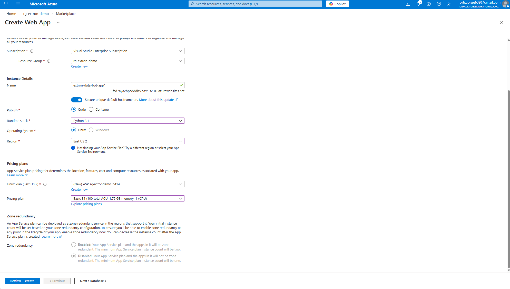

**Step 4 — Configure the App Service**

1. Go to your App Service → **Settings** → **Environment variables**
2. Add these application settings:

   | Name | Value |
   |------|-------|
   | `AZURE_OPENAI_ENDPOINT` | Your Azure OpenAI endpoint URL |
   | `AZURE_OPENAI_API_KEY` | Your API key |
   | `AZURE_OPENAI_DEPLOYMENT_NAME` | Your deployment name (e.g. `gpt-5-mini`) |
   | `DATASOURCE` | `excel` or `sql` |
   | `EXCEL_FOLDER_PATH` | Path to your `.xlsx` folder (when `DATASOURCE=excel`) |
   | `SQL_SERVER` | SQL Server hostname (when `DATASOURCE=sql`) |
   | `SQL_DATABASE` | Database name (when `DATASOURCE=sql`) |
   | `SQL_TABLE` | Table or view name (when `DATASOURCE=sql`) |
   | `SQL_TRUSTED_CONNECTION` | `yes` for Windows auth (when `DATASOURCE=sql`) |
   | `MICROSOFT_APP_ID` | Application (client) ID from Step 1 |
   | `MICROSOFT_APP_PASSWORD` | Client secret value from Step 1 |
   | `MICROSOFT_APP_TENANT_ID` | Directory (tenant) ID from Step 1 |
   | `SCM_DO_BUILD_DURING_DEPLOYMENT` | `1` |

   > **Security variables (`REQUIRE_AUTH`, `FILE_DOWNLOAD_GROUP_ID`)** are
   > configured later in [Checkpoint 4](#checkpoint-4-secure-access--internal--user-restricted)
   > — don't set them now.

   Only include the data source variables for the option you chose —
   Excel **or** SQL Server, not both.

   > **Why `SCM_DO_BUILD_DURING_DEPLOYMENT`?** Without it, Azure copies your
   > files but never runs `pip install`. This flag tells the Oryx build
   > system to install your Python dependencies automatically.

3. Click **Apply** and confirm

4. Go to **Settings** → **Configuration** → **General settings**
   - Startup command: `antenv/bin/python main.py`
   - Click **Save**

**Step 5 — Deploy your code**

First, zip your code: right-click the `chat_agent/` folder →
**Compress to ZIP file**.

> **Important:** The `wheels/` folder inside `chat_agent/` must be
> included in the zip. It contains `agent-framework-core` and
> `agent-framework-azure-ai`, which are pre-release packages that
> require the `--pre` flag in `requirements.txt` to install correctly.

**Option A — Azure CLI (quickest)**

Open a terminal in the same folder where `chat_agent.zip` was saved, then run:

```bash
az webapp deployment source config-zip --resource-group <your-resource-group> --name <your-app-service-name> --src chat_agent.zip
```

> **Why `config-zip` and not `az webapp deploy`?** The `deploy --type zip`
> command does not always trigger the Oryx build (pip install). The
> `config-zip` command reliably triggers the build. The CLI will warn
> it's deprecated — ignore that, it still works.

> Don't have the Azure CLI? Install it from
> [https://learn.microsoft.com/cli/azure/install-azure-cli](https://learn.microsoft.com/cli/azure/install-azure-cli),
> then run `az login` before deploying.

**Option B — GitHub (best for ongoing updates)**

1. Push your code to a GitHub repo (public or private — both work)
2. Azure Portal → your App Service → **Deployment** → **Deployment Center**
3. Source: **GitHub** → sign in and select your repo and branch
4. Click **Save** — Azure will pull and deploy automatically on every push

**Step 6 — Point Bot Service to App Service**

1. Go to your Bot Service → **Settings** → **Configuration**
2. Set **Messaging endpoint** to:
   ```
   https://<your-app-service-name>.azurewebsites.net/api/messages
   ```
3. Click **Apply**

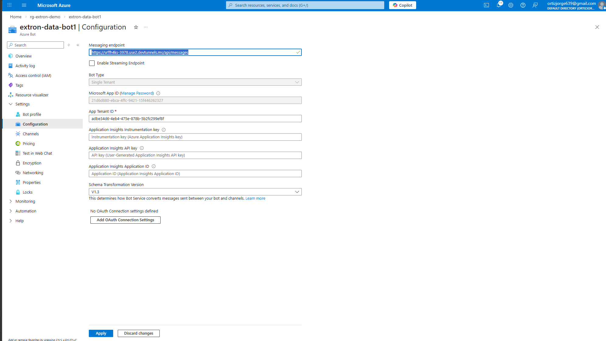

**Step 7 — Test it**

1. Go to your Bot Service → **Test in Web Chat**
2. Ask: *"How many rows are there?"*
3. If you get an answer, Checkpoint 2 is done.

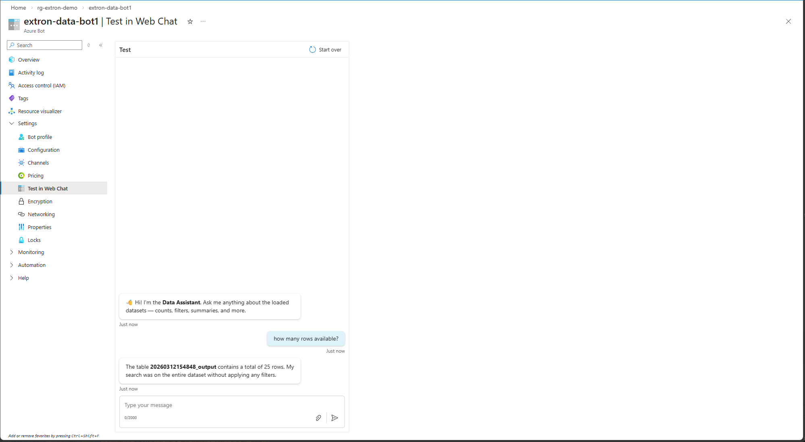

> **Note:** The App Service deployment and Checkpoint 4 security
> controls were validated end-to-end on 2026-03-31. If you hit issues,
> check the Troubleshooting table below.

#### Troubleshooting

| Symptom | Likely cause | Fix |
|---------|-------------|-----|
| "Test in Web Chat" shows nothing | Messaging endpoint is wrong or App Service isn't running | Check the endpoint URL ends with `/api/messages`; check App Service logs |
| `Unauthorized` errors | App ID / password / tenant ID mismatch | Double-check all three values match between Entra, Bot Service, and App Service env vars |
| `missing service principal` | App Registration has no service principal | Azure Portal → Entra ID → Enterprise applications → search your app. If missing, create one via `az ad sp create --id <APP_ID>` |
| App Service returns 5xx | Startup command not set or dependencies missing | Check **Log stream** in App Service; verify startup command is `antenv/bin/python main.py` |
| `ModuleNotFoundError: agent_framework_azure_ai` | Oryx build didn't install all dependencies | Ensure `agent-framework-azure-ai` is in `requirements.txt` with `--pre` flag; redeploy with `config-zip` |
| `antenv/bin/python: not found` | Oryx build didn't run or timed out | Verify `SCM_DO_BUILD_DURING_DEPLOYMENT=1` is set; use `config-zip` (not `deploy --type zip`); check build logs |
| `AADSTS700054: response_type 'id_token' is not enabled` | App registration missing redirect URI and ID tokens | Entra ID → App registrations → your app → Authentication → Add Web platform with redirect URI `https://<app>.azurewebsites.net/.auth/login/aad/callback` → enable **ID tokens** |
| `unexpected keyword argument 'tool_choice'` | Agent Framework version mismatch | Pin exact versions in `requirements.txt` to match bundled wheels; redeploy |

### Checkpoint 3: Teams ✅

Goal: bot is usable inside Microsoft Teams.

Prerequisites:
- Checkpoint 2 must be working (bot responds in Azure Portal "Test in Web Chat")
- Your tenant must allow custom bot sideloading (see Step 1 below)

**Step 1 — Verify your tenant allows custom apps**

1. Open Teams → **Apps** (left sidebar) → **Manage your apps** → look for
   **"Upload a custom app"** at the bottom

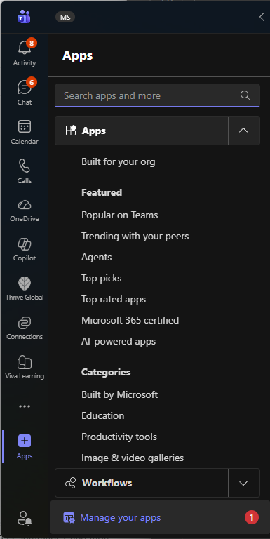
2. If the button is missing, your Teams admin needs to enable it:
   - Teams Admin Center → **Setup policies** → enable *"Upload custom apps"*
   - Teams Admin Center → **Permission policies** → ensure custom apps aren't blocked
   - These are **two separate settings** — the first shows the upload button,
     the second allows the app to actually run

**Step 2 — Update the Teams app manifest**

The app package is already in `teams-app/` with three files:
- `manifest.json` — bot definition for Teams
- `outline.png` — 32×32 icon (placeholder)
- `color.png` — 192×192 icon (placeholder)

Open `teams-app/manifest.json` and replace both instances of
`<your-app-id-from-entra>` with the **Application (client) ID**
from Checkpoint 2, Step 1. Save the file.

**Step 3 — Zip and upload**

1. Open the `teams-app/` folder, select all three files
   (`manifest.json`, `outline.png`, `color.png`), right-click →
   **Compress to ZIP file**. Don't zip the folder itself — the files
   must be at the root of the zip or Teams will reject it.
2. Open Teams → **Apps** → **Manage your apps** → **Upload a custom app**

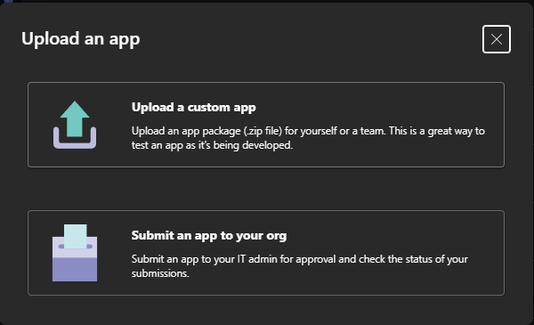

3. Select your zip file
4. Teams will show your bot's details — click **Add**

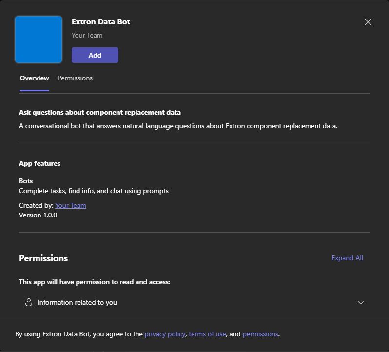

**Step 4 — Test it**

1. Open a chat with **Extron Data Bot** in Teams
2. Ask: *"How many rows are there?"*
3. If you get an answer, Checkpoint 3 is done.

> During testing, Checkpoints 1 and 2 were verified end-to-end.
> Checkpoint 3: the Teams app installs and appears in the chat list,
> but messages are silently blocked by my corporate tenant policy —
> the bot never receives them. This is not a code or configuration
> issue. "Test in Web Chat" (which uses the same Bot Service pipeline)
> works correctly. Once your tenant allows custom bots to communicate,
> Teams should work without code changes.

---

### Checkpoint 4: Secure Access — Internal & User-Restricted

Goal: the web app is accessible **only by approved users** — not
everyone in the tenant — and network access is restricted to authorized
sources only.

Prerequisites:
- Checkpoint 2 must be working (bot responds in Azure Portal "Test in Web Chat")

> **Why this matters.** The bot exposes internal supply chain data.
> Without these controls, anyone with the URL or tenant access can
> query it.

**Step 1 — Configure network restrictions (infrastructure team)**

> **Important — Teams requires inbound access from Microsoft's cloud.**
> When a user sends a message in Teams, it routes through Microsoft's
> Bot Service — which lives outside your corporate VNet. A fully
> private endpoint (public access disabled) blocks this traffic and
> **breaks both Teams and "Test in Web Chat"**.
>
> Work with your infrastructure team to choose one of these approaches:
>
> | Approach | How it works | Teams? |
> |----------|-------------|--------|
> | **Application Gateway** | Private App Service behind a gateway that accepts Bot Service traffic | ✅ Yes |
> | **Access restrictions** | Public endpoint, allowlist `AzureBotService` service tag + corporate VPN range, deny all else | ✅ Yes |
> | **Private endpoint only** | No public access at all | ❌ No — Bot Service and Teams blocked |
>
> The app is **internal-only from a user standpoint** (Entra ID enforces
> this). The networking choice controls which *infrastructure services*
> can reach the App Service.

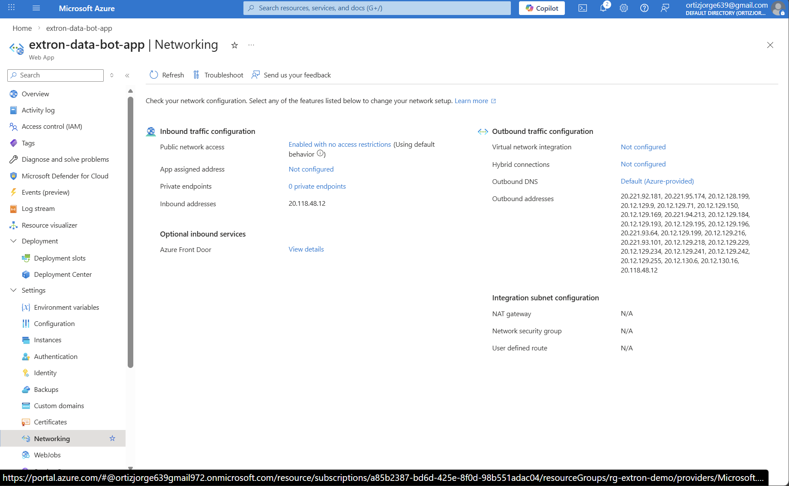

Verify with your infrastructure team that the chosen approach is in
place before proceeding. If using access restrictions, confirm:

1. Azure Portal → your App Service → **Networking** → **Access restrictions**
2. `AzureBotService` service tag is allowed (for Teams / "Test in Web Chat")
3. Corporate VPN IP range is allowed (for web UI access)
4. All other traffic is denied

**Step 2 — Enable Entra ID authentication (Easy Auth)**

Gate every HTTP request behind a Microsoft sign-in — no code changes
needed. Two parts: configure the app registration, then enable Easy Auth.

**Part A — Configure the app registration for web sign-in**

1. Azure Portal → **Microsoft Entra ID** → **App registrations** →
   Select your app (e.g. `Extron Data Bot`)

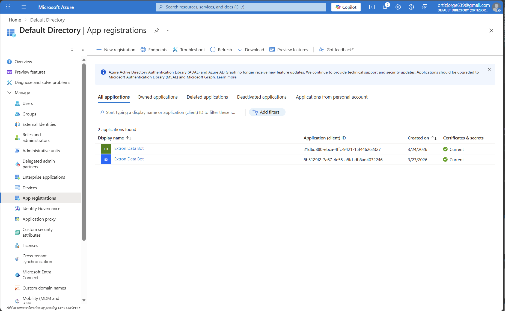

2. Go to **Authentication** → **Add a platform** → select **Web**
3. Redirect URI:
   ```
   https://<your-app-service-name>.azurewebsites.net/.auth/login/aad/callback
   ```
   Then, Under **Implicit grant and hybrid flows**, check **ID tokens** and hit Configure

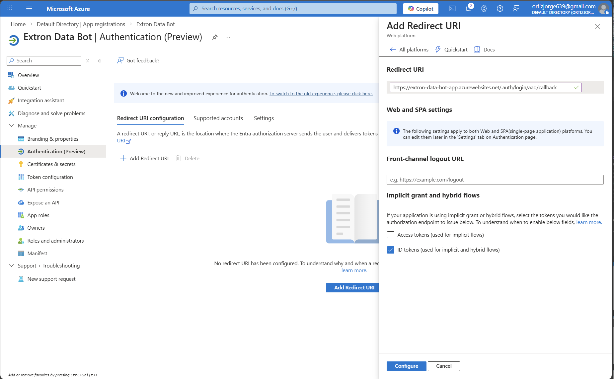

4. Verify in Settings Tab: Under **Implicit grant and hybrid flows**, check **ID tokens**
5. Leave all other fields as defaults
6. Click **Save**

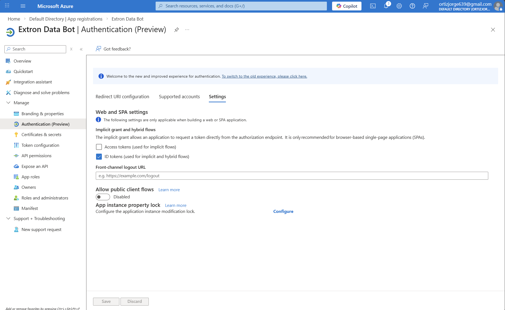

> **Why is this needed?** Easy Auth completes the login by redirecting
> back to the `/.auth/login/aad/callback` URL with an ID token. Without
> the redirect URI and ID tokens enabled, sign-in fails with
> `AADSTS700054`.

**Part B — Enable Easy Auth on the App Service**

1. Azure Portal → your App Service → **Authentication**

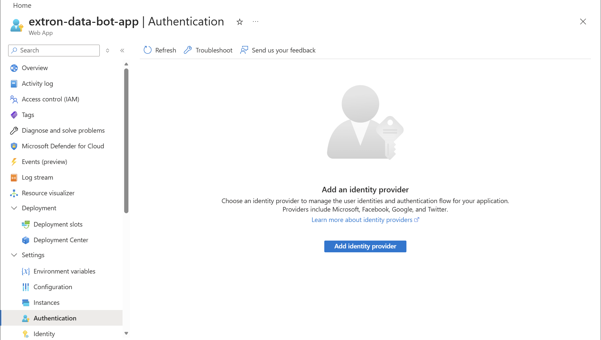

2. Click **Add identity provider**
3. Identity provider: **Microsoft**
4. App registration type: **Pick an existing app registration**
5. Select the same app registration (e.g. `Extron Data Bot`)

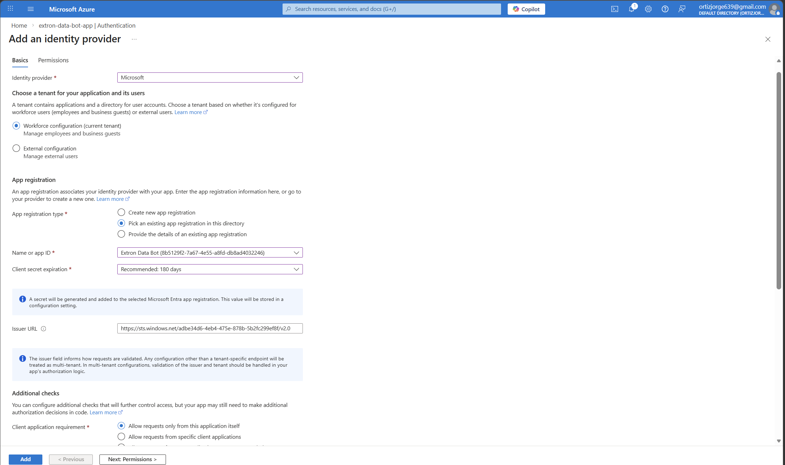

6. Unauthenticated requests: **HTTP 302 Found redirect**
7. Token store: **On**
8. Leave all other fields as their defaults — no other changes needed

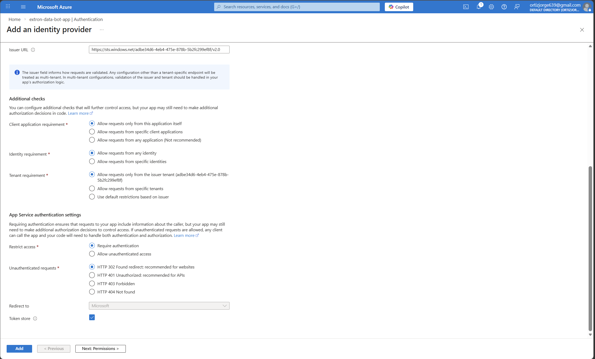

9. Click **Add**

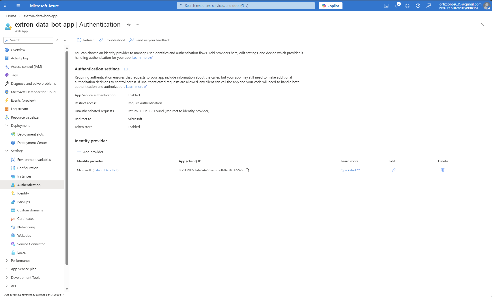

Once saved, the web UI (`/`) and `/api/chat` require a Microsoft login.
`/api/messages` is unaffected — Bot Framework has its own auth.

Then set this environment variable on the App Service to enable
defense-in-depth in the app code:

| Name | Value |
|------|-------|
| `REQUIRE_AUTH` | `true` |

> Where: Add this environment variable to the App Service (Settings → Environment variables → Add):

> **What does this do?** A safety net — if Easy Auth is ever
> misconfigured, the app itself rejects unauthenticated requests.

Verify before proceeding:

1. Open the web UI in a **private/incognito window** — you should be
   redirected to a Microsoft login page
2. Sign in with your account — you should reach the chat UI
3. Check App Service → **Authentication** in the portal — status should
   show **Enabled** with your identity provider listed

**Step 3 — Limit access to specific users or groups**

By default, any user in the tenant can sign in. To restrict access to
a specific set of people:

1. Azure Portal → **Microsoft Entra ID** → **Enterprise applications**

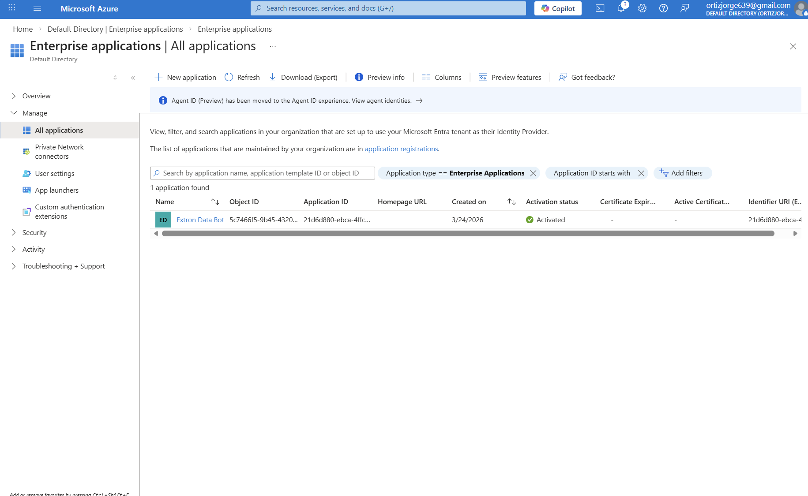

2. Search for your app (e.g. `Extron Data Bot`) and open it

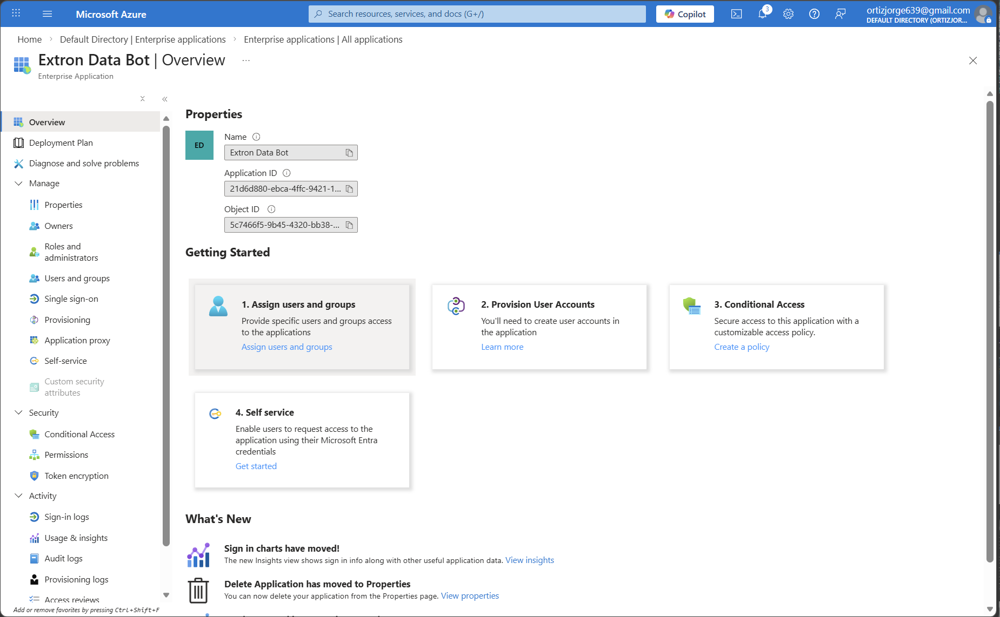

3. Go to **Overview**
4. Under **Getting Started**, click **1. Assign users and groups** →
   **Assign users and groups**
5. Select the individuals that should have access and click **Select**

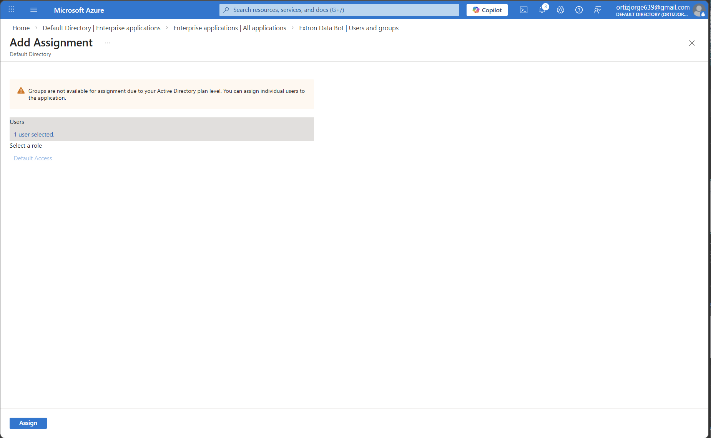

6. Click **Assign** — the user now appears in the assigned list

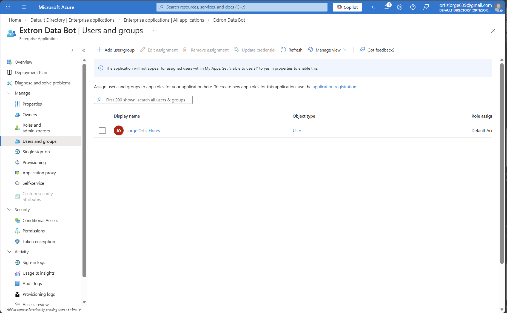

Anyone not assigned will see an error when they try to sign in —
they will not be able to reach the web UI or the Teams bot.

> **Recommended:** Create two security groups in Entra ID:
>
> - `SG-Extron-Bot-Chat` — can use the bot and view inline data (most users)
> - `SG-Extron-Bot-Download` — can also download generated Excel files (select analysts only)
>
> Assign **both** groups to the Enterprise Application so members of
> either group can sign in. Step 4 handles which group can download.

**Step 4 — Restrict file downloads to a specific group**

The bot generates Excel files when users query data. By default, all
authenticated users can download these files. To restrict downloads to
a smaller group:

1. **Enable group claims** — Azure Portal → **Microsoft Entra ID** →
   **App registrations** → your app → **Token configuration** →
   **Add groups claim** → select **Security groups** → click **Add**

   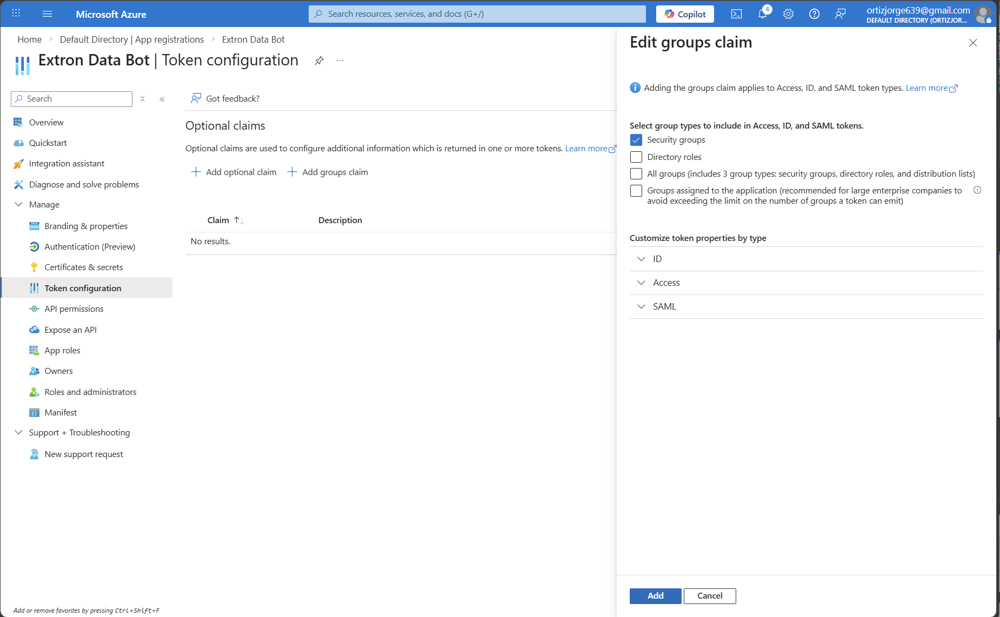

   > **This step is critical.** Without it, the identity token won't
   > contain group memberships and the download check will silently
   > fail (all downloads blocked).

2. **Create the download security group** — Azure Portal →
   **Microsoft Entra ID** → **Groups** → **New group**

   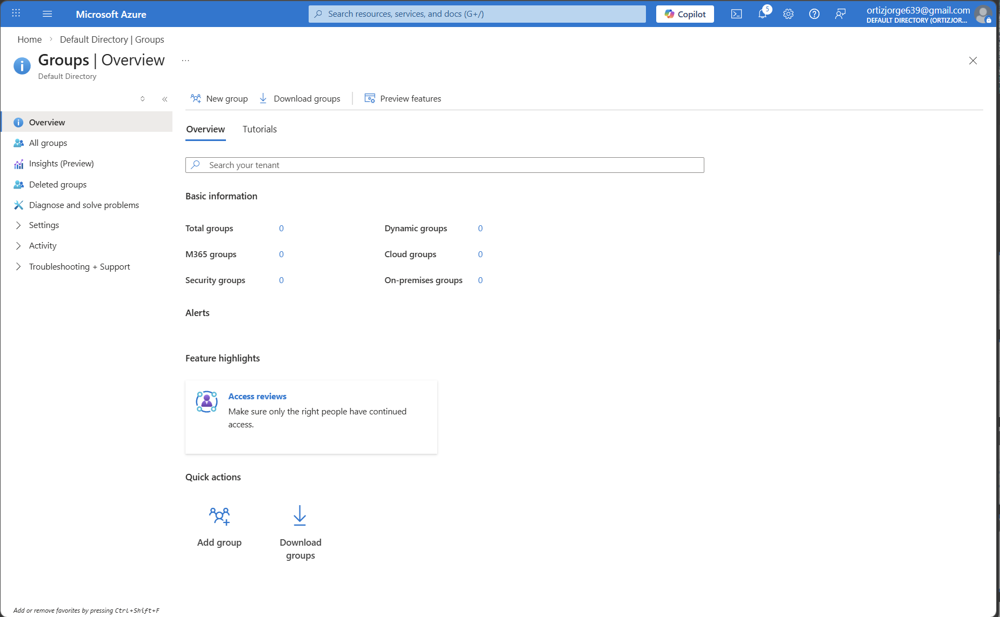

   Set **Group type** to **Security**, name it
   `SG-Extron-Bot-Download`, add the users who should be able to
   download files, and click **Create**.

   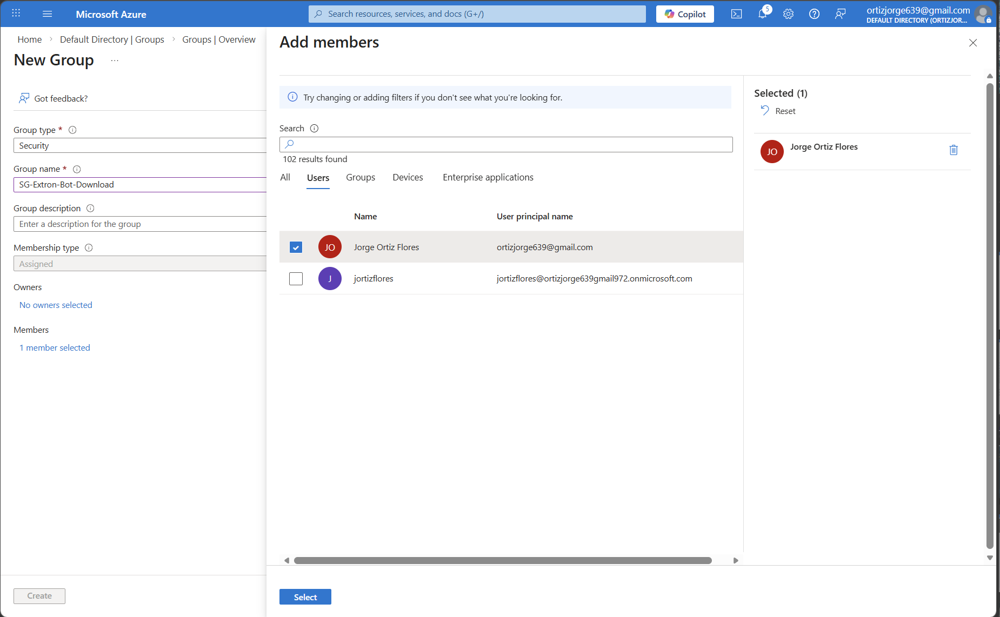

3. **Get the group's Object ID** — Once created, open the group and
   copy the **Object ID** shown in the list.

   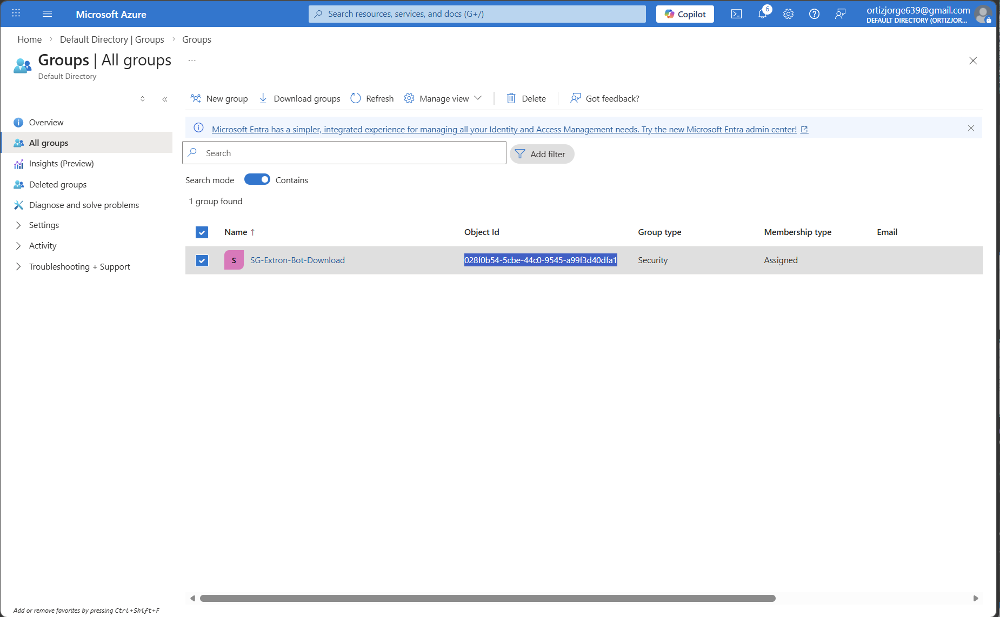

4. **Add this environment variable** to the App Service (Settings →
   Environment variables → **Add**):

   | Name | Value |
   |------|-------|
   | `FILE_DOWNLOAD_GROUP_ID` | The Object ID from step 3 |

   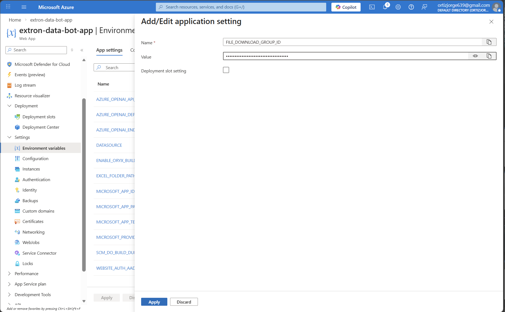

   Click **Apply** to save.

   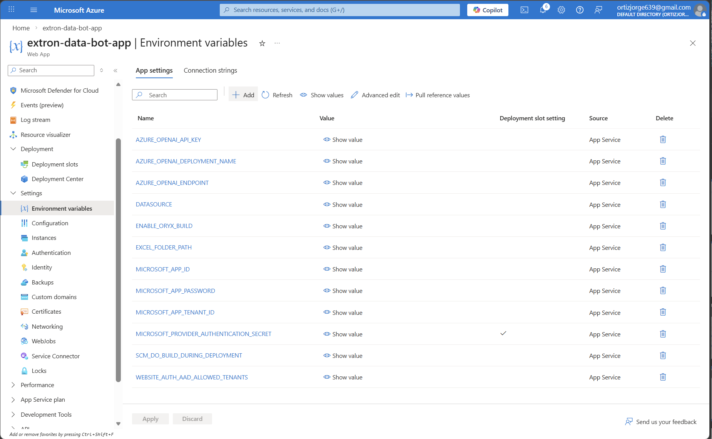

Once configured:
- Users in the download group see inline data **and** get a download
  link for the full Excel file
- Users **not** in the group see the inline data but no download link
- Direct URL access to `/api/files/` returns `403 Forbidden`

Leave `FILE_DOWNLOAD_GROUP_ID` blank to allow all authenticated users
to download (the default).

**Step 5 — Control Teams bot visibility (Teams admin task)**

Steps 1–4 block unauthorized access. This step hides the bot so
unauthorized users don't encounter it in the first place.

> **Prerequisite:** Step 1 networking must allow `AzureBotService`
> traffic — otherwise Teams cannot reach the bot.

Ask your **Teams administrator** to:

1. **Teams Admin Center** → **Manage apps** → upload the app package
   to the **Org app catalog**
2. Go to **Setup policies** → create or edit a policy
3. Under **Installed apps**, add your bot
4. Assign the policy to the same security group from Step 3

Only assigned users will see the bot in Teams — everyone else won't
know it exists.

**Step 6 — Test it**

Run through these checks in order. Each builds on the previous one.

1. **Network** — Access the App Service URL from an unauthorized network
   (not on VPN, not Bot Service) → should be denied
2. **Easy Auth** — Open the web UI in a private/incognito window →
   should redirect to Microsoft login
3. **User restriction** — Sign in as a user **not** in the assigned
   group → should see an access denied error
4. **Download restriction** — Sign in as a user **not** in the download
   group, run a query → should see inline data but no download link
5. **Download allowed** — Sign in as a user **in** the download group,
   run the same query → should see the download link

   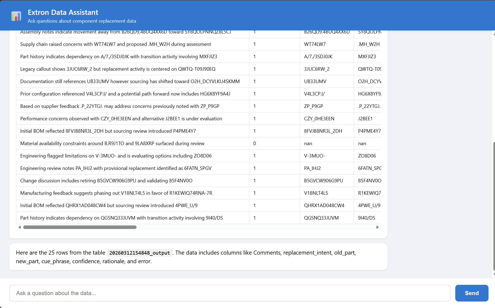

6. **Direct file access** — Try `/api/files/<filename>` as a
   non-download user → should return `403`
7. **Teams visibility** — Sign in to Teams as a non-assigned user →
   bot should not appear in the app list
8. **Defense-in-depth** — Send a request to `/api/chat` without Easy
   Auth headers → should return `401`

If all checks pass, Checkpoint 4 is done.

---

### Scaling (future)

Single-instance App Service works for the POC. Two changes for production:

| Change | Why | Effort |
|--------|-----|--------|
| Azure Redis Cache for sessions | In-memory sessions break with multiple instances | ~20 lines |
| Azure Container Apps for hosting | Auto-scales on traffic, scales to zero when idle | Add Dockerfile, re-point endpoint |

Same bot code, same data layer, same tools. No rewrite.

---

## What the Bot Can Do

| Capability | Example question |
|------------|-----------------|
| Exact counts | "How many comments have replacement intent?" |
| Full record lists | "Show all rows where confidence > 0.9" |
| Column filters | "List comments where old_part contains CQ" |
| Group & summarize | "Break down counts by replacement_intent" |
| Distinct values | "What are all the unique old_part values?" |
| Chunked output | Large results are sent in 60-row chunks; download link shown to authorised users |
| Follow-up context | "How many were there?" uses prior conversation context |

---

## Provision Azure OpenAI

If you already have an Azure OpenAI resource deployed (e.g., from the data
extraction experiment), **reuse it**. Just grab the endpoint, key, and
deployment name, paste into your environment variables, and skip this section.
Any model that supports tool calling works (GPT-4o, GPT-4.1 mini, GPT-5 mini, etc.).

If you need to create one from scratch:

1. Azure Portal → **Create a resource** → search **Azure OpenAI** → **Create**
2. Resource group: use your existing one (e.g. `rg-extron`)
3. Region: **East US 2** (or wherever your other resources are)
4. Name: `extron-openai` (this becomes your custom domain —
   the endpoint will be `https://extron-openai.openai.azure.com/`)
5. Pricing tier: **S0**
6. Click **Review + create** → **Create**

Once created, deploy a model:

7. Go to your Azure OpenAI resource → **Model deployments** → **Manage Deployments**
   (this opens Azure AI Foundry)
8. Click **Deploy model** → **Deploy base model**
9. Select a model with tool calling support (e.g. `gpt-4.1-mini` or `gpt-5-mini`)
10. Deployment name: `gpt-5-mini` (or whatever you prefer — this is your
    `AZURE_OPENAI_DEPLOYMENT_NAME`)
11. Set **Tokens per Minute Rate Limit** to **30K+** (we hit 429 rate limits at 10K)
12. Click **Deploy**

Then grab your credentials:

13. Go to your Azure OpenAI resource → **Keys and Endpoint**
14. Copy the **Endpoint** and one of the **Keys**

> **Capacity 30K+ tokens/min recommended.** We started at 10K and hit
> 429 rate limits on every other request. 30K handles interactive use.
> For production with concurrent users, use 50K+ or provisioned throughput.

---

## Environment Variables

| Variable | Required | Default | Description |
|----------|----------|---------|-------------|
| `AZURE_OPENAI_ENDPOINT` | Always | — | `https://<name>.openai.azure.com/` |
| `AZURE_OPENAI_API_KEY` | Always | — | From Azure Portal |
| `AZURE_OPENAI_DEPLOYMENT_NAME` | Always | `gpt-4.1-mini` | Model deployment name (mini recommended) |
| `DATASOURCE` | Always | `excel` | `excel` or `sql` |
| `EXCEL_FOLDER_PATH` | When excel | `./data/mock` | Folder with .xlsx files |
| `SQL_SERVER` | When sql | — | SQL Server hostname |
| `SQL_DATABASE` | When sql | — | Database name |
| `SQL_TABLE` | When sql | — | Table or view |
| `SQL_TRUSTED_CONNECTION` | When sql | `yes` | `yes` = Windows auth |
| `SQL_USERNAME` | SQL auth | — | SQL login |
| `SQL_PASSWORD` | SQL auth | — | SQL password |
| `MICROSOFT_APP_ID` | For Teams | — | Entra app registration |
| `MICROSOFT_APP_PASSWORD` | For Teams | — | Client secret |
| `MICROSOFT_APP_TENANT_ID` | For Teams | — | Azure AD tenant ID |
| `REQUIRE_AUTH` | Production | `false` | `true` to enforce Easy Auth on web UI (see [Checkpoint 4](#checkpoint-4-secure-access--internal--user-restricted)) |
| `FILE_DOWNLOAD_GROUP_ID` | Production | — | Azure AD Object ID of group allowed to download files |
| `BOT_PORT` | Always | `3978` | Server port |
| `LOG_LEVEL` | Always | `INFO` | Python log level |

---

## Technical Decisions

| Decision | Why |
|----------|-----|
| Microsoft Agent Framework | Microsoft's current primary agent framework — simpler than Semantic Kernel |
| Mini model (GPT-5 mini) | Bot routes tool calls, not complex reasoning — cheaper and faster |
| SingleTenant bot | MultiTenant is deprecated in Azure Bot Service |
| App Service (not Functions) | Bot needs a persistent web server with in-memory sessions |

---

## Project Structure

```
chat_agent/
├── main.py                  # aiohttp server — web UI + Bot Framework endpoint
├── chat.py                  # Terminal chat for quick testing
├── Dockerfile               # Container build (Python 3.11-slim)
├── .env.example             # All env vars, documented
├── requirements.txt         # Python dependencies
├── static/
│   └── index.html           # Web chat UI (served at localhost:3978)
├── bot/
│   └── bot_handler.py       # Bot Framework activity handler
├── agent/
│   ├── kernel.py            # Agent setup, system prompt, session management
│   └── plugins/
│       └── data_plugin.py   # 7 data tools the LLM can call
├── data/
│   ├── loader.py            # Excel / SQL Server loader with paging + filtering
│   └── mock/                # .xlsx files loaded at startup
└── config/
    └── settings.py          # Pydantic settings from .env
```
